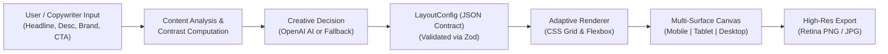

# AI-Powered Adaptive Creative Layout Engine

[](https://www.typescriptlang.org/)
[](https://react.dev/)
[](https://tailwindcss.com/)
[](https://expressjs.com/)
[](https://openai.com/)
[](https://vitest.dev/)

> Built for the **Software Engineering Internship** at **Flam**, a company pioneering AI-native, interactive, and visual content experiences.

---

## 1. Problem Statement

Creating digital advertisements across modern marketing channels requires adapting creative assets for heterogeneous screen surfaces—from ultra-compact mobile feeds (9:16 vertical stories) to tablet display units and expansive desktop billboards (16:9). 

Historically, platforms have relied on two flawed paradigms:
1. **Simple CSS Media Queries**: Shrinking desktop banners down for mobile screens leads to microscopic unreadable text, degraded visual hierarchy, and cramped CTA touch-targets.
2. **Hardcoded Templates**: Static templates fail to respect the intrinsic nuances of individual campaigns (e.g. text length, image aspect ratios, luxury vs urgency messaging, and color contrast).

---

## 2. Solution Overview

The **Adaptive Creative Layout Engine** is an intelligent visual synthesis system that transforms raw copy, imagery, and brand guidelines into mathematically balanced, visually appealing creatives.

Instead of generating arbitrary, unconstrained HTML/CSS or raw code, the engine utilizes a **Structured Layout Decision Pipeline**:



---

## 3. Key Features

- **Multi-Surface Structural Adaptation**:
  - **Mobile (390 × 680 px)**: Vertical orientation flow, hero image elevated above headline, full-width thumb-zone CTA buttons, optimized touch targets.
  - **Tablet (768 × 600 px)**: Balanced 50/50 dual-column proportion, condensed margins, reflowed badge headers.
  - **Desktop (1080 × 600 px)**: Expansive horizontal grid, dual-column typography, floating glass badges, aligned CTAs.
- **8 Distinct Creative Layout Archetypes**:
  1. `image-left-content-right`: High-converting classic split hero.
  2. `image-right-content-left`: Feature launches and editorial storytelling.
  3. `centered-product`: Symmetrical spotlight on flagship products.
  4. `full-background-image`: Immersive billboard with glassmorphic text card.
  5. `split-screen`: Dynamic contrasting color blocks for high-urgency promotions.
  6. `minimal-editorial`: Luxury serif typography and generous negative space.
  7. `product-focused`: Hero imagery dominates 65-70% of canvas with streamlined pill CTA.
  8. `text-focused`: Bold typographic banner and high-converting message emphasis.
- **OpenAI AI Layout Assistant**:
  - Leverages OpenAI (`gpt-4o-mini` with JSON mode) to analyze brand tone, audience psychology, and copy length.
  - Generates structured JSON adhering to a strict schema.
  - Formulates design rationale: Visual Hierarchy, Color Harmony, Responsive Strategy, and Art Director Tips.
- **Deterministic Fallback Layout Engine**:
  - 100% resilient offline capability without external API dependencies.
  - Implements an algorithmic decision tree evaluating copy density, discount signals, and campaign objectives.
  - Automated WCAG AA contrast ratio calculation ensuring readable typography.
- **Bidirectional Live Studio Inspector**:
  - Real-time manual overrides for layout archetypes, typography scale, font weight, letter spacing, alignment, image fit, and canvas colors.
  - Changes instantly update the preview canvas without page reloads.
- **Image Upload & Curated Presets**:
  - Drag-and-drop file upload with client-side base64 preview.
  - Instant pre-loaded campaign presets (Fashion Sale, Food Delivery, SaaS Copilot, Luxury Perfume, Solstice Festival).
- **Retina Canvas Export**:
  - Generates 2x pixel-ratio PNG and JPG downloads preserving typography sharpness and color fidelity.

---

## 4. Architecture

```mermaid
graph TD
    subgraph Frontend["Frontend (Vite + React 18 + Tailwind CSS)"]
        UI["Top Header & Device Switcher"]
        InputPanel["Studio Input Panel\n(Copy, Upload, Brand Colors)"]
        Inspector["Live Tweaker & AI Rationale Inspector"]
        Canvas["Multi-Surface Viewport Canvas"]
        Renderer["Adaptive Layout Renderer\n(8 Template Strategies)"]
        Export["High-Res Exporter\n(html-to-image)"]
        ClientFallback["Client Fallback Engine"]
    end

    subgraph Backend["Backend (Node.js + Express + TypeScript)"]
        Router["/api/generate-layout"]
        InVal["Input Zod Validator"]
        DecisionEngine{"OpenAI Key Present?"}
        OpenAIService["OpenAI GPT-4o-mini AI Assistant"]
        OutVal["LayoutConfig Zod Validator"]
        ServerFallback["Deterministic Fallback Engine\n(WCAG AA Contrast + Heuristics)"]
    end

    InputPanel --> Router
    Router --> InVal
    InVal --> DecisionEngine
    DecisionEngine -- Yes --> OpenAIService
    OpenAIService --> OutVal
    OutVal -- Valid --> Router
    OutVal -- Invalid / Error --> ServerFallback
    DecisionEngine -- No --> ServerFallback
    ServerFallback --> Router
    Router --> UI
    UI --> Renderer
    Inspector --> Renderer
    Renderer --> Canvas
    Canvas --> Export
    UI -. Network Fail .- -> ClientFallback
    ClientFallback -. Fallback Layout .- -> Renderer
```

---

## 5. Technology Stack

| Layer | Technology | Purpose |
| :--- | :--- | :--- |
| **Frontend UI** | React 18, TypeScript, Tailwind CSS | High-density, professional SaaS creative studio |
| **Icons & Design** | Lucide React | Modern, minimalist interface iconography |
| **Canvas Export** | `html-to-image` | High-DPI (2x retina) PNG and JPG export |
| **Backend API** | Node.js, Express, TypeScript, `tsx` | RESTful layout generation microservice |
| **Generative AI** | `openai` (Official SDK, GPT-4o-mini) | Context-aware layout reasoning & structured JSON generation |
| **Schema Validation** | Zod | Runtime validation for both client input & AI JSON |
| **Testing** | Vitest | Fast unit testing for schema contracts and heuristics |

---

## 6. Folder Structure

```
creative-layout-engine/
├── backend/
│   ├── src/
│   │   ├── controllers/      # Express route controllers
│   │   │   └── layoutController.ts
│   │   ├── routes/           # REST endpoints (/api/generate-layout)
│   │   │   └── layoutRoutes.ts
│   │   ├── schemas/          # Zod validation schemas
│   │   │   └── layout.schema.ts
│   │   ├── services/         # AI service & fallback decision tree
│   │   │   ├── aiService.ts
│   │   │   └── fallbackEngine.ts
│   │   ├── tests/            # Vitest unit test suite
│   │   │   └── fallbackEngine.test.ts
│   │   └── index.ts          # Server entrypoint
│   ├── package.json
│   ├── tsconfig.json
│   └── .env.example
├── frontend/
│   ├── src/
│   │   ├── components/       # Header, InputPanel, PreviewCanvas, InspectorPanel
│   │   ├── constants/        # Device specifications, presets, templates
│   │   ├── renderer/         # CreativeRenderer & 8 layout template strategies
│   │   ├── services/         # API client & client-side fallback
│   │   ├── types/            # TypeScript interfaces
│   │   ├── utils/            # Canvas exporter
│   │   ├── App.tsx           # Master state & layout orchestrator
│   │   ├── main.tsx          # DOM root mount
│   │   └── index.css         # Tailwind directives & typography
│   ├── index.html
│   ├── package.json
│   ├── tsconfig.json
│   ├── tailwind.config.js
│   └── vite.config.ts
├── shared/
│   └── types.ts              # Shared domain models
├── package.json              # Monorepo root scripts
├── .gitignore
└── README.md
```

---

## 7. Setup & Local Development

### Prerequisites
- Node.js `v18.0.0+` (Tested on `v22.16.0`)
- npm `v9.0.0+`

### Step 1: Install Dependencies
From the project root:
```bash
npm run install:all
```

### Step 2: Environment Configuration
Copy `.env.example` in `backend/`:
```bash
cp backend/.env.example backend/.env
```

Contents of `backend/.env`:
```env
PORT=5000
HOST=0.0.0.0
NODE_ENV=development
# Provide your OpenAI API Key:
OPENAI_API_KEY=your_openai_api_key_here
OPENAI_MODEL=gpt-4o-mini
```

> **Note on AI Mode**: The system functions completely out-of-the-box even without an `OPENAI_API_KEY`. When no key is provided, the deterministic rule-based engine generates high-quality responsive designs automatically.

### Step 3: Run the Servers

**Option A — Monorepo root:**
```bash
npm run dev:backend
npm run dev:frontend
```

**Option B — Independent terminals:**
- **Terminal 1 (Backend API):** `cd backend && npm run dev` (running on `http://localhost:5000`)
- **Terminal 2 (Frontend Studio):** `cd frontend && npm run dev` (running on `http://localhost:3000`)

Visit **`http://localhost:3000`** in your browser.

---

## 8. Automated Testing

Run the Vitest test suite on backend:
```bash
npm test
```

Verified test coverage includes:
- Schema validation against malformed or missing fields.
- Deterministic fallback engine layout decisions based on headline length, discount tags, and campaign tone.
- WCAG AA contrast preservation and auto-text luminance correction.
- Comprehensive test validation for all 5 diverse campaign archetypes (Fashion Sale, Food Delivery, SaaS Product, Festival, E-commerce).

---

## 9. Production Build

```bash
# Build both backend TypeScript and frontend bundle
npm run build

# Start production server
npm start
```

---

## 10. Deployment to Render & GitHub

### Option A: Render Blueprint (Recommended — 1-Click Unified Service)
The repository includes a root `render.yaml` configuration file.
1. Push the repository to GitHub.
2. In the Render Dashboard, click **New +** → **Blueprint**.
3. Select your repository.
4. Render automatically configures:
   - **Build Command**: `npm run install:all && npm run build`
   - **Start Command**: `npm start`
   - **Environment Variables**: Set `OPENAI_API_KEY` in the Render Environment Variables tab.
5. Click **Apply**. Render builds both services and serves the frontend studio with backend API on a single URL!

### Option B: Separate Services on Render
- **Backend (Web Service)**:
  1. Set **Root Directory**: `backend`
  2. Set **Build Command**: `npm install && npm run build`
  3. Set **Start Command**: `npm start`
  4. Environment Variables: `OPENAI_API_KEY`, `OPENAI_MODEL=gpt-4o-mini`
- **Frontend (Static Site)**:
  1. Set **Root Directory**: `frontend`
  2. Set **Build Command**: `npm install && npm run build`
  3. Set **Publish Directory**: `dist`
  4. Environment Variables: `VITE_API_BASE_URL=https://your-backend.onrender.com`

---

## 11. Future Enhancements

- **Vector SVG & Canvas Export**: Direct SVG/Canvas code generation for print and programmatic video ad animation.
- **Multimodal Image Analysis**: Using Gemini Vision to extract dominant palette swatches and focal points directly from uploaded product photos.
- **Animation & Micro-interactions**: View Transitions API for animated device switches and layout morphing.
